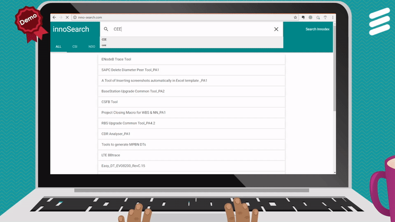
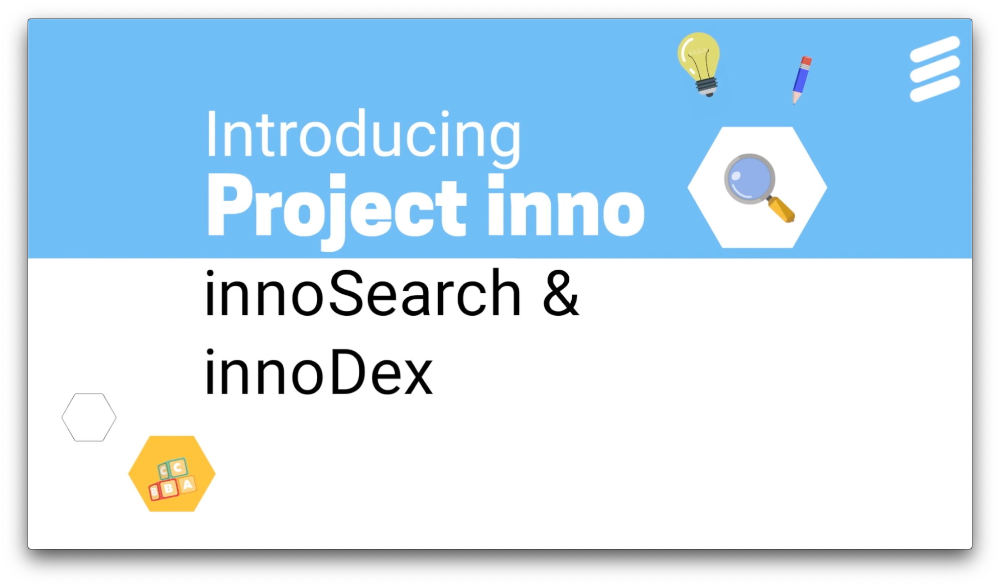
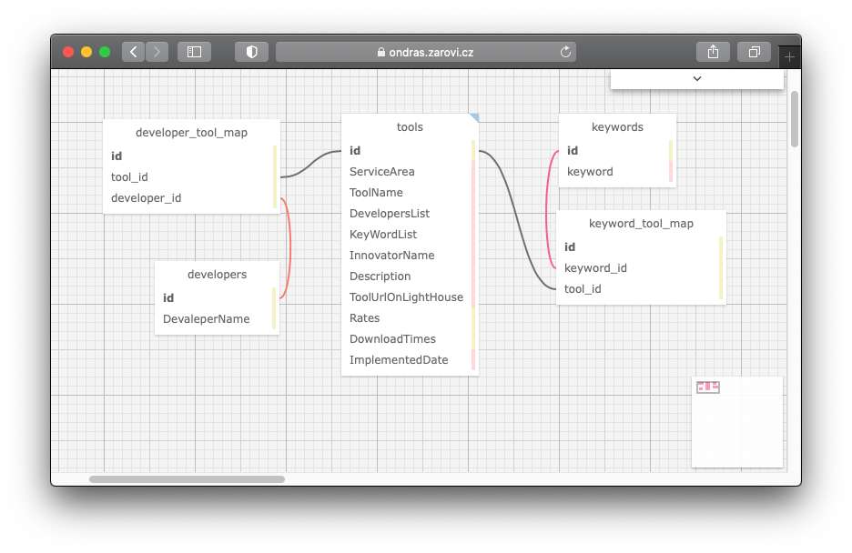

# Yet another Lighthouse

Lighthouse was an automation/ tool sharing platform in my origization many years ago and this project was a PoC to redesign it, built with Flask and Materialize CSS.

This was my first side project triggering me design layout, db scehma as mentioned in [about me](https://note.siwei.info/about/), which end up being a developer years later.



## Promo video

A promo video was created by me and voiced by Michael Shi, click for watching it on [viemo](https://vimeo.com/219328622).

[](https://vimeo.com/219328622)


## Database Schema



## How To

### requriement
Frontend framework Materialize was used materialize-v0.98.0.
Python html2text by Aaron Swartz was used: https://github.com/aaronsw/html2text

```
pip install flask
pip install openpyxl
pip install html2text
pip install Flask-WhooshAlchemy-Redux
pip install sqlalchemy-migrate
pip install flask_wtf
pip install -U pytagcloud
    apt-get install python-pygame
    apt-get build-dep python-pygame
    pip install pygame
    pip install simplejson
pip install -U nltk
```
### A fresh setup sqlite
```
./db_create.py
./dataMigrate.py
./run.py
```
### Cleanup
```
rm -fr *.db
rm -fr db_repository
```

### Deployment with nginx
```
(env)# apt-get install nginx
(env)# pip install gunicorn
(env)# vi wsgi.py
#!env/bin/python
from app import app
application = app
if __name__ == “__main__”:
    application.run()

(env)# gunicorn -w 4 -b 127.0.0.1:8080 wsgi
```

```
/etc/nginx/sites-available/default
server {
    listen 80;
    server_name inno-search.com;

    location / {
        proxy_pass http://127.0.0.1:8080; # to gunicorn host
        proxy_set_header Host $host;
        proxy_set_header X-Forwarded-For $proxy_add_x_forwarded_for;
    }

  }

```

## Rights

used photo https://unsplash.com/photos/GYNxcQvBNzA Rights reserved by Etienne Desclides( https://unsplash.com/@atn )